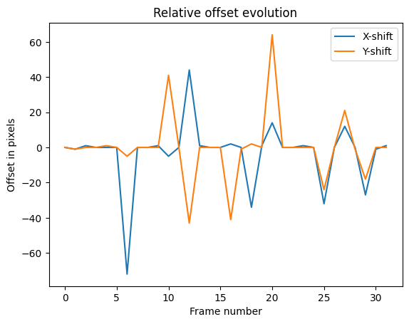
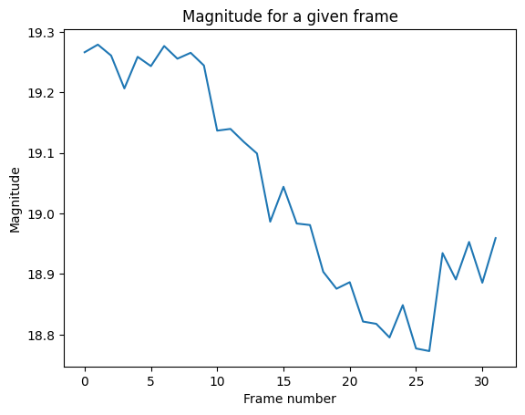
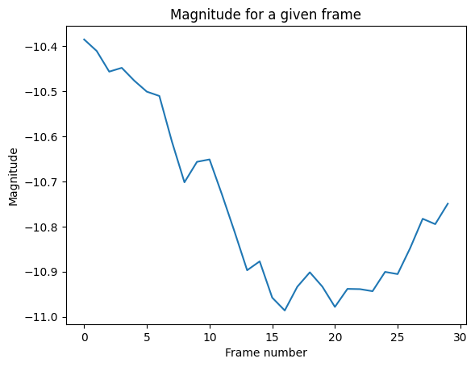
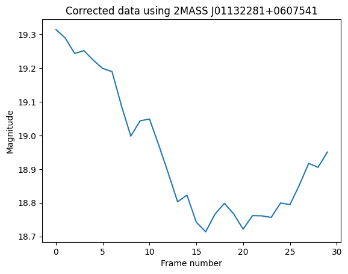
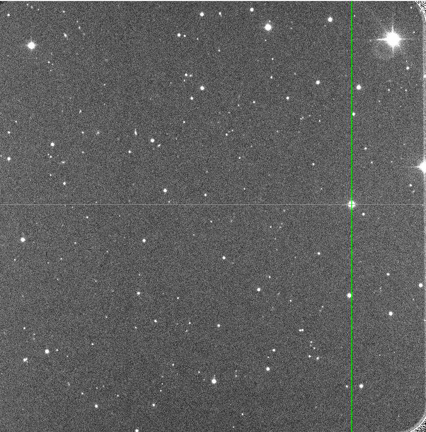

Astronomical Data Processing
 
- Report -
 

Léo BECHET, M2 CompuPhys 2024-2025

## Ⅰ Theoretical Method 

### 1. **Introduction to Photometric Analysis**
Photometric analysis is a method used to study the brightness variations of astronomical objects over time, providing insights into their physical properties, such as rotation periods. For asteroid $1999\ TD_{10}$, we performed a photometric analysis across two observation nights. This section outlines the steps involved in conducting the analysis, from frame alignment to the calculation of the asteroid's rotation period.

---

### 2. **Observational Setup**

#### 2.1 **Target and Reference Star**
The photometric analysis of $1999\ TD_{10}$ was carried out by aligning the frames around the asteroid's position using a bright reference star. The reference star chosen for this study was **2MASS J01132281+0607541**, which was visible in all of the observation frames. The alignment was crucial to ensure that the asteroid’s movement could be tracked relative to a stable coordinate system.

#### 2.2 **Field of View and Image Metadata**
The observations were made using a field of view of 13.5 x 13.6 arcminutes. The plate solving performed with **astrometry.net** provided the following metadata:
   - **[Night 8](https://nova.astrometry.net/user_images/11285189#annotated)**:
     - Center coordinates (RA, Dec): (18.420, 6.057)
     - Pixel scale: 0.395 arcsec/pixel
   - **[Night 9](https://nova.astrometry.net/user_images/11356787#annotated)**:
     - Center coordinates (RA, Dec): (18.375, 6.033)
     - The field size and pixel scale were the same as on Night 8, ensuring consistency between the two nights.

---

### 3. **Frame Alignment**

#### 3.1 **Relative Offset Calculation**
To align the frames, we calculated the relative offsets between each consecutive frame based on the position of the reference star. Since the reference star is bright and stable, it served as a reliable anchor for frame registration. We neglected any potential rotational changes and focused solely on translational offsets, assuming that the orientation of the frames remained constant.

#### 3.2 **Reference Frame Setup**
The first frame of each observation night was selected as the reference frame. All subsequent frames were aligned to this reference coordinate system by applying the calculated offsets, ensuring that all frames had the same spatial orientation. This step allows us to track the asteroid’s motion in a consistent coordinate system throughout the observations.

---

### 4. **Positioning and Tracking of $1999\ TD_{10}$**

#### 4.1 **Linear Interpolation of Movement**
To track the asteroid’s movement across the frames, we assumed that its motion was linear and uniform. The corrected position of $1999\ TD_{10}$ at the end of the observation period was used as the reference point for interpolating its position in each frame. The asteroid’s movement was calculated based on this linear assumption, and its position was estimated in each frame accordingly.

#### 4.2 **Frame-by-Frame Tracking**
Using the linear interpolation method, we computed the asteroid’s position for each frame in the reference coordinate system. This allowed us to accurately determine the asteroid’s location in each image, ensuring that the brightness measurements were consistent and corresponded to the correct position of the asteroid.

---

### 5. **Photometric Analysis**

#### 5.1 **Flux Measurement and Background Subtraction**
Once the asteroid’s position was determined, we measured the flux from the pixels corresponding to the asteroid’s location in each frame. To isolate the asteroid’s flux, we subtracted the background sky flux, which was measured in a nearby region free from bright sources. This step ensured that any variations in brightness due to sky conditions were removed, providing a more accurate measurement of the asteroid's intrinsic brightness. We are however aware of the potential errors this method may introduce due to other object being close to the asteroid.

#### 5.2 **Magnitude Calculation**
The background-subtracted flux was then used to compute the apparent magnitude of $1999\ TD_{10}$ for each frame. The magnitude was calculated using standard photometric relations, where the flux from the object is related to its brightness. By repeating this measurement for each frame, we constructed a time-resolved light curve for the asteroid.

---

### 6. **Time Series and Rotation Period Estimation**

#### 6.1 **Light Curve Construction**
For each frame, the Modified Julian Date (MJD) was recorded, allowing us to build a time-series of the asteroid's apparent magnitude. This time-resolved light curve displayed the brightness variations of $1999\ TD_{10}$ over the course of the two nights of observation.

#### 6.2 **Sinusoidal Fitting and Period Determination**
The light curve was then analyzed by fitting a sinusoidal function to the data. Since the asteroid’s brightness variations are assumed to result from its rotation, the sinusoidal fit models these periodic fluctuations. The period of the fitted sinusoidal curve corresponds to the asteroid’s rotation period. By determining the period of the curve, we estimate the rotation period of 1999 $1999\ TD_{10}$.

---

## Ⅱ Application and Results

### $\alpha$ Observations on October 8th

In this section, we analyze the photometric data collected on October 8th for the asteroid $1999\ TD_{10}$. The steps include computing relative and absolute offsets for frame alignment, validating the tracking accuracy, calculating the asteroid’s magnitude, and determining its rotation period.

---

#### $\alpha$.1. **Frame Alignment and Offset Calculation**

To align frames and ensure accurate tracking of the asteroid, we first computed both relative and absolute offsets for each frame using the reference star **2MASS J01132281+0607541**. This star’s position was measured in each frame to establish a consistent coordinate system throughout the observation period. The relative offsets capture the frame-to-frame changes, while the absolute offsets confirm the star’s overall stability in the field of view.

To validate tracking accuracy, we plotted the position of the reference star within a defined search box across frames. **Figure 1** shows the relative offset values, while **Figure 2** displays the absolute offsets of the reference star. These plots demonstrate stable alignment, indicating that the tracking setup was robust.

<table style="border: none">
  <tr style="border: none">
    <td style="text-align: center; border: none">
      
      
Figure 1: Relative offsets for Oct 8th.

    </td>
    <td style="text-align: center; border: none">
      
      
Figure 2: Absolute offsets for Oct 8th.

    </td>
  </tr>
</table>

---

#### $\alpha$.2. **Asteroid Position Tracking**

Using the computed frame offsets, we tracked the pixel positions of the asteroid across the frames. Key positions include:
   - **Start position** (Frame 96): (1150, 1156)
   - **End position** (Frame 266): (1172, 1104)  corrected : (1266, 1109)

Since the motion is considered to be linear and uniform and each frame has the same exposure time, we proceed to a simple interpolation to get the position for each frame. 

---

#### $\alpha$.3. **Asteroid Magnitude Calculation and Validation**

The photometric analysis of the asteroid’s brightness involved computing the instrumental magnitude for each frame. To validate the magnitude calculations, we displayed subframes centered around the asteroid, allowing visual inspection of the asteroid’s appearance across frames. This inspection confirmed that the magnitude measurements corresponded accurately to the object’s position.

The final plot showing the evolution of the asteroid’s instrumental magnitude over time is presented in **Figure 3**. This graph reveals the asteroid’s brightness variations, which we analyze further to determine its rotation period.

<table style="border: none">
  <tr style="border: none">
    <td style="text-align: center; border: none; width: 500rem;">
      
      
Figure 3: Evolution of the magnitude relative to the frame number.

    </td>
  </tr>
</table>
---

#### $\alpha$.4. **Astrometric Calibration and Magnitude Scaling**

For accurate magnitude calibration, we performed plate solving on the first frame using **astrometry.net**. This provided precise image metadata:
   - **Center (RA, Dec)**: (18.420, 6.057)
   - **Field size**: 13.5 x 13.6 arcmin
   - **Pixel scale**: 0.395 arcsec/pixel

Using ALADIN, we identified **2MASS J01132281+0607541** as a suitable reference star. This star, cataloged in VIZIER with an R-band magnitude of 13.1, provided a baseline for calibrating our magnitude measurements. The magnitude offset was calculated as:
   \[
   \text{mag\_offset} = \text{mag}_{2MASS} - \text{mag}_{\text{obs}}
   \]
Adding this offset to the instrumental magnitudes yielded a calibrated mean magnitude for the asteroid around 19.0. **Figure 4** displays the calibrated light curve of $1999\ TD_{10}$, with a mean magnitude near 19.

<table style="border: none">
  <tr style="border: none">
    <td style="text-align: center; border: none; width: 500rem;">
      
      
Figure 4: Corrected magnitude using <b>2MASS J01132281+0607541</b> in function of the MJD date.

    </td>
  </tr>
</table>

---

#### $\alpha$.5. **Rotation Period Analysis**

To determine the rotation period, we fitted the magnitude data to a sinusoidal model of the form:
   \[
   f(x) = \text{amp} \cdot \sin\left(\frac{2 \pi}{a} \cdot x + b\right) + c
   \]
where the parameters represent the amplitude, period, phase shift, and mean magnitude, respectively. The fitting process yielded the following results:
   - **Mean magnitude**: 19.04
   - **Magnitude variation (amplitude)**: 0.46
   - **Period**: 0.325 MJD

From this fit, we conclude that the rotation period of $1999\ TD_{10}$ is approximately 0.325 days, and its mean calibrated magnitude is 19.04. The final sinusoidal fit of the light curve is presented in **Figure 5**, illustrating the periodic brightness variations corresponding to the asteroid’s rotation.

<table style="width: 100%; border: none;">
  <tr style="border: none;">
    <td style="text-align: center; border: none; width: 500rem;">
      
      
Figure 5: Fitted sinusoid to the observational data.

    </td>
  </tr>
</table>

---

### β Observations on October 9th

This section summarizes the photometric analysis conducted on October 9th for asteroid $1999\ TD_{10}$, following the methodology established for the October 8th observations. Here, we present the frame alignment, magnitude calculations, and fitted rotation period, based on the data collected on this specific date.

---

#### β.1. **Frame Alignment and Offset Calculation**

Using the reference star **2MASS J01132281+0607541**, relative and absolute offsets were computed to align the frames for October 9th. Tracking accuracy was validated through offset plots. **Figure 6** and **Figure 7** display the relative and absolute offsets, respectively, which confirm the stability of the tracking setup for this date.

<table style="border: none">
  <tr style="border: none">
    <td style="text-align: center; border: none">
      
      
Figure 6: Relative offsets for Oct 9th.

    </td>
    <td style="text-align: center; border: none">
      
      
Figure 7: Absolute offsets for Oct 9th.

    </td>
  </tr>
</table>

---

#### β.2. **Asteroid Position Tracking**

The asteroid’s movement was tracked using pixel positions in each frame, assuming uniform linear motion. Key positions recorded include:
   - **Start position** (Frame 66): (1513, 863)
   - **End position** (Frame 151): (1856, 597)  corrected : (1843, 719)

Interpolation provided the asteroid’s position across all frames for magnitude calculation.

---

#### β.3. **Asteroid Magnitude Calculation and Validation**

As with the October 8th data, we computed the asteroid’s instrumental magnitude for each frame. Validation was achieved through subframe inspections, which verified consistency in the asteroid's brightness measurements.

The evolution of the asteroid’s magnitude over time on October 9th is presented in **Figure 8**.

<table style="border: none">
  <tr style="border: none">
    <td style="text-align: center; border: none; width: 500rem;">
      
      
Figure 8: Evolution of the magnitude relative to the frame number for Oct 9th.

    </td>
  </tr>
</table>

---

#### β.4. **Astrometric Calibration and Magnitude Scaling**

Astrometric calibration for October 9th was based on plate solving of the first frame, yielding the following image metadata:
   - **Center (RA, Dec)**: (18.375, 6.033)
   - **Field size**: 13.5 x 13.6 arcmin
   - **Pixel scale**: 0.395 arcsec/pixel

Magnitude scaling was performed using **2MASS J01132281+0607541** as a reference star with an R-band magnitude of 13.1. The corrected magnitude plot, adjusted with the magnitude offset, is shown in **Figure 9**.

<table style="border: none">
  <tr style="border: none">
    <td style="text-align: center; border: none; width: 500rem;">
      
      
Figure 9: Corrected magnitude using <b>2MASS J01132281+0607541</b> in function of the MJD date for Oct 9th.

    </td>
  </tr>
</table>

---

#### β.5. **Rotation Period Analysis**

The rotation period was derived by fitting the corrected magnitude data to a sinusoidal model, resulting in:
   - **Mean magnitude**: 19.01
   - **Magnitude variation (amplitude)**: 0.58
   - **Period**: 0.372 MJD

**Figure 10** presents the fitted sinusoidal curve for October 9th, highlighting the periodic variations due to the asteroid’s rotation.

<table style="width: 100%; border: none;">
  <tr style="border: none;">
    <td style="text-align: center; border: none; width: 500rem;">
      
      
Figure 10: Fitted sinusoid to the observational data for Oct 9th.

    </td>
  </tr>
</table>

---

The analysis for October 9th corroborates the findings from October 8th, with a consistent rotation period and similar mean magnitude, confirming the robustness of our photometric approach for asteroid $1999\ TD_{10}$.

### γ Combined Data Analysis

In this final section, we analyze the combined photometric data from both October 8th and October 9th to produce a comprehensive view of the asteroid $1999\ TD_{10}$'s light curve and rotation period. By merging the datasets from both nights, we increase the temporal coverage and statistical robustness of our measurements.

---

#### γ.1. **Combined Sinusoidal Fit**

With the combined dataset, we applied the same sinusoidal model as before to fit the magnitude variations across both nights’ observations. The merged data yields a refined fit, summarized by the following parameters:
   - **Mean magnitude**: 19.02
   - **Magnitude variation (amplitude)**: 0.49
   - **Period**: 0.33 MJD

**Figure 11** below presents the fitted sinusoidal curve applied to the combined data. The data points from both nights align closely with the fitted curve, showing a consistent pattern in the asteroid’s brightness fluctuations.

<table style="width: 100%; border: none;">
  <tr style="border: none;">
    <td style="text-align: center; border: none; width: 500rem;">
      
      
Figure 11: Combined fit of the sinusoidal model to the October 8th and October 9th data.

    </td>
  </tr>
</table>

---

#### γ.2. **Goodness of Fit: MSE and R² Analysis**

To assess the fit quality, we calculated the **Mean Squared Error (MSE)** and **R²** metrics for the combined model:
   - **MSE**: 0.0043
   - **R²**: 0.88

The **MSE** provides an estimate of the average squared difference between the observed and predicted magnitudes, where a lower MSE indicates a closer fit. The value of 0.0043 suggests a minimal error in the magnitude predictions, reflecting high accuracy.

The **R²** value of 0.88 indicates that 88% of the variance in the asteroid’s brightness is explained by the sinusoidal model, suggesting a strong correlation between the fitted model and the observed data. This high R² value confirms that the combined fit effectively captures the periodic brightness variations and represents a slight improvement over the fits for individual nights.

However, it’s important to consider that the sinusoidal model is a simplification and does not capture all factors contributing to magnitude variations. The brightness of $1999\ TD_{10}$ fluctuates due to the asteroid’s irregular shape and surface features, which cause variations as different parts of the asteroid reflect sunlight during its rotation. Additionally, the limitations of ground-based observations introduce unpredictable atmospheric effects, such as seeing conditions, light scattering, and slight shifts in background noise, which can further influence the data.

These influences mean that while a sinusoidal model is useful for approximating the rotation period, it cannot account for every subtle fluctuation in brightness. Despite these complexities, the R² value of 0.88 is high and demonstrates that the sinusoidal model provides a reliable and accurate representation of the overall periodic brightness variation. For our observational purposes, this fit is highly effective in estimating the asteroid’s rotation period and mean magnitude.

---

#### γ.3. **Comparison with Individual Nights**

Compared to the separate analyses for October 8th and October 9th, the combined data produces a similar mean magnitude and period, reinforcing the reliability of the observed rotation period. However, the combined dataset provides a more accurate amplitude and overall fit, with improvements in both MSE and R². These enhancements result from the increased sample size and continuity of data across two nights, which smooths out potential noise and captures the object’s periodic variation more robustly.

By combining observations, we conclude with increased confidence that the asteroid’s mean magnitude is approximately 19.02, with a rotation period of about 0.33 MJD, and a magnitude variation of 0.49. These findings provide a comprehensive view of $1999\ TD_{10}$’s photometric characteristics and rotational behavior.

## Appendix

### A. ALADIN Exploitation

<table style="width: 100%; border: none;">
  <tr style="border: none;">
    <td style="text-align: center; border: none; width: 500rem;">
      
      
Figure A.1: Capture of the ALADIN exploitation with 2MASS catalog loaded.

    </td>
  </tr>
</table>

<table style="width: 100%; border: none;">
  <tr style="border: none;">
    <td style="text-align: center; border: none; width: 500rem;">
      
      
Figure A.2: Capture of the ALADIN exploitation with a combination of catalogs loaded.

    </td>
  </tr>
</table>

Above are shown the plate-solved exploitation on ALADIN used to determine the reference star for magnitude calibration.

### B. Reference Stars

<table style="width: 100%; border: none;">
  <tr style="border: none;">
    <td style="text-align: center; border: none; width: 500rem;">
      
      
Figure B.1: Reference star used for offsets computation of the 8th October.

    </td>
  </tr>
</table>

<table style="width: 100%; border: none;">
  <tr style="border: none;">
    <td style="text-align: center; border: none; width: 500rem;">
      
      
Figure B.2: Reference star used for offsets computation of the 9th October.

    </td>
  </tr>
</table>

Above are shown which star was selected as the reference star for the computation of offsets for each night.